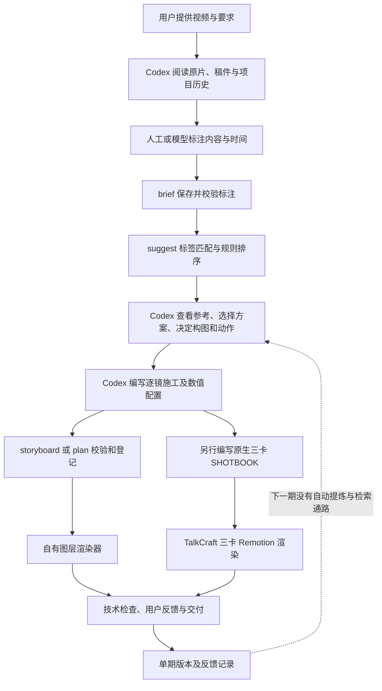

# Winter Video Agent：项目整体审计

本报告保留2026-10-06的历史状态。2026-10-07已完成参考场景复建及新原片代表段迁移，当前可用范围见 [里程碑 v1](milestone-talking-head-reference-v1.md)。

审计日期：2026-10-06。审计基线：本仓库 `main` 的 `4e2d793`，本报告加入之前的状态。依据包括自有源码、五个固定版本子模块、项目文档、提交记录、仓库外现有项目清单及其计划和产物记录。本次没有制作视频、重新渲染或改造生产代码。

## 1. 结论与判断边界

目前项目已经实现了外部视频项目管理、参考索引、数据驱动动画执行、版本记录、技术检查和交付，也开始运行三项 TalkCraft 原生组件。它尚未实现用户最关心的能力：根据新内容稳定选择合适的成熟视觉方案，将已确认的制作判断迁移到下一期，让用户不必反复充当导演。

当前实际形态可以描述为：**由每次 Codex 会话承担理解和设计的一组制作工具，加上一套文档中的制作纪律**。执行工具可复用，具体计划可续作；形成好看的方案仍大量依赖当次会话和用户修订。`core/cli.py` 开头就明确写着 creative decisions remain with Codex。

这并不意味着所有开发都无效。文件隔离、确定性渲染、原片保护、来源追踪、已有动效代码都是有效资产。方向上的问题是：开发主要在解决“给定施工单如何运行”，而用户要解决的是“给定内容如何得到足够好的施工单，以及这种能力如何积累”。两者之间的缺口一直由人工反馈填补。

本审计能确认实现和流程缺口，不能据此判定某个渲染工具天然没有审美，或者更换模型、改用 AE 就会自动解决问题。也不把文档中尚未完成的计划算成现有能力。

## 2. 原定目标与实际发展方向

用户的目标有三层：短期在 Codex 中直接使用；输入口播、文稿或产品素材，稳定完成适合内容的制作；长期可以把同一能力包装为软件或网页。用户明确允许复用成熟上游代码，要求先分析案例及素材库，再设计和实现，并且接受的是制作逻辑，不是固定配色和元素。

仓库最初的 [吸收计划](/Users/winter/Documents/Project/winter-video-agent/docs/reuse-plan.md) 与此基本一致：三个 workflow 保留成熟内部结构，公共 core 管理项目和交付。M2 原计划首先接入 TalkCraft 的 CPU 时间戳、SHOTBOOK、镜头组件、分段渲染和 QA。

实际路线首先发展了自有口播覆层引擎，之后逐步补关系线、数值动画、分组动作、保护区、施工记录。完整上游生产流程没有先成为底座。直到最新提交才增加三项原生卡片，形成另一条执行路径。[生产选择文档](/Users/winter/Documents/Project/winter-video-agent/docs/production-routing.md) 已承认这个偏差，但其下一步仍围绕样片反馈继续适配，尚未处理能力积累的核心问题。

## 3. 全仓结构：每一层现在负责什么

本报告加入前，自有 Git 跟踪常规文件共 67 个，约 0.53 MB，包含 24 个 Markdown 文件。自有文件总行数 10,830，其中依赖锁文件占 5,215 行。这些数字用于区分体量，不能代表开发完成度；子模块内容不计入上述自有文件数字。

| 层级 | 当前内容 | 实际作用及限制 |
| --- | --- | --- |
| 根目录 | AGENTS、README、Git 配置 | 边界、入口、来源固定；未形成独立 Agent 程序 |
| `core/` | 9 个文件 | CLI、项目 JSON、参考检索、施工记录、渲染及交付调度；只实现口播生产入口 |
| `workflows/` | 6 个文件，全部在 talking-head | 选卡评分、三卡原生 Remotion 执行、依赖清单和历史原型 |
| `library/` | 21 个文件 | 五种编排方法、七类基础图层配方、索引与来源、三卡原始及适配源码 |
| `scripts/` | 5 个文件 | 编译、检索、注册计划、逐帧渲染等确定性操作 |
| `skills/` | 入口及 4 份说明 | 告诉 Codex 如何分析和调用；这些要求仍需要会话中的模型落实 |
| `docs/` | 15 份既有文档 | 契约、计划、里程碑、参考说明、制作方法；包含已实现和未来内容 |
| `tests/` | 2 个文件 | 数据计划和规划规则的测试；不验证视觉审美和跨期设计迁移 |
| 五个子模块 | 固定版本源码及参考 | 可阅读、比较和吸收；不会因为目录存在就自动参与生产 |

不存在 `workflows/product-promo/` 或 `workflows/knowledge-explainer/` 的生产实现。ThreeUI 作为组件来源的定位正确，Awesome Opus 作为案例来源的定位也正确。

## 4. 实际工作链：哪些由工具完成，哪些仍靠会话



图中最难的两个步骤——从内容到方案、从方案到完整构图动作——仍在当前会话里完成。保存记录提高了可追踪性，没有自动填补这两个步骤。

### 4.1 创建、素材、检查

[`new`](/Users/winter/Documents/Project/winter-video-agent/core/cli.py:37) 必须提供已有视频路径，探测媒体信息并创建外部项目。第 55 行把主流程直接写为 talking-head；当前没有三条流程自动路由，也没有从文章或主题直接创建其他生产项目的能力。

`asset` 登记 ID、绝对路径、哈希、大小和来源说明。它没有自动理解素材内容、建立截图区域语义或检索可用素材的能力。`inspect` 列文件、目录大小、产物与缺失路径；它不会观看视频、分析对白，名称中的 inspect 指项目清单检查。

大素材留在原目录，通过登记引用。此边界已经落实，对避免 Agent 仓库膨胀有价值。相应代价是项目依赖原文件路径，需要明确管理迁移和归档，当前没有完整的可搬运项目打包功能。

### 4.2 brief、suggest、storyboard

[`brief`](/Users/winter/Documents/Project/winter-video-agent/core/planning.py:86) 有两种行为：保存已写好的内容标注；或从旧计划生成待填写骨架。它明确返回 No transcription performed，不做转写、字级对齐或内容理解。

[`suggest`](/Users/winter/Documents/Project/winter-video-agent/core/planning.py:115) 按已标注的语义与卡片标签交集、素材种类、段落位置和近期选择进行排序。它不比较画面，不理解背景对比、构图、画面密度和整片节奏。ShotCraft 条目没有接入同一语义标签体系，因此通常只能通过关键词进入关联参考，不能把这一步描述为多库视觉方案自动推荐。

`storyboard` 要求 Codex 提供参考依据、选择理由、对象、阶段、阅读时间和施工 JSON，再检查字段、覆盖和关联。这能减少记录遗漏，但存在记录不等于存在正确判断。参考证据允许图片、视频、代码或文档；文件存在、哈希正确、findings 非空，不能证明模型看懂动态效果，也不能证明产物忠实继承了它。

当前完成的 storyboard 最终登记语义图层计划。原生三卡需要另行书写 SHOTBOOK；二者没有完整的生成和联动关系。命令具备记录与校验功能，不具备其名称容易让人联想到的完整导演能力。

### 4.3 自有图层执行

[`semantic-plan`](/Users/winter/Documents/Project/winter-video-agent/core/semantic-plan.mjs) 校验时间、图层、素材引用、保护区和可选的无遮罩要求。支持文字、图片、面板、线条、连接线、数字计数和比例条。坐标、尺寸、颜色、关键帧由计划提供，仍是绝对像素布局。

[`choreography`](/Users/winter/Documents/Project/winter-video-agent/library/motion/choreography.mjs) 把对象姿态、分组阶段和证据聚焦展开为图层。它可以复用动作执行方式，但不会自动决定主体多大、元素怎么成组、在哪个时间交接。指标卡可复用共同尺度和数字增长；默认白字、浅绿等样式仍需要根据背景覆盖，没有自动对比判断或完整主题系统。

[`stage.html`](/Users/winter/Documents/Project/winter-video-agent/library/recipes/progressive-explanation/stage.html) 用 DOM/SVG 执行计划；[`render-semantic-preview.mjs`](/Users/winter/Documents/Project/winter-video-agent/scripts/render-semantic-preview.mjs) 通过浏览器逐帧输出 PNG，再由 FFmpeg 叠加到一段原视频上，保留原音频。

它能生成动画，不能独立完成一般意义上的自动剪辑：没有自动删改和重排口播、自动 ASR/对齐、视频 B-roll 图层、完整音效音乐混音和生成模型调度。现有成功口播输入本身已经人工剪过。

`--shot` 可以输出局部预览，但全片没有已经接通的改动镜头缓存重组；新的全片版本仍要按范围重新逐帧运行。数据配置提高执行复用率，同时也可能把写代码的工作变成书写大量数值配置。

### 4.4 原生 TalkCraft 执行

[`core/talkcraft.py`](/Users/winter/Documents/Project/winter-video-agent/core/talkcraft.py:15) 当前只允许三个镜头：`doc-park-left-pill-deal`、`grid-to-hero`、`media-pop-in`。原始与适配 TSX 都保留，来源提交及修改点可追溯。依赖在仓库外，输入用硬链接或跨卷复制，独立版本保存实例。这是实质代码复用。

但它是三个镜头的执行适配，尚未成为完整 TalkCraft 流程。CPU 时间戳、完整 SHOTBOOK 制作体系、全局 theme、镜头生命周期、字幕、声音、分段拼接及完整 QA 没有一起接通。

[`Root.tsx`](/Users/winter/Documents/Project/winter-video-agent/workflows/talking-head/native/Root.tsx:17) 把卡片作为宽 960 的逻辑画布，按本期 x/y/scale 叠到人物视频上，补固定标题样式和末尾淡出。它保留部分原生动画计算，同时改变了原生卡片的呈现环境。因此“用了作者动画源码”不能等同于“保留了成品的完整视觉组织”。字体、比例、人物与卡片的空间关系依旧需要设计。

原生路径可以单独运行，没有要求必须完成公共 brief/suggest/storyboard。当前共有自有语义引擎、原生三卡路径、旧 FFmpeg 图片覆层路径；执行选择存在，统一的设计到执行链仍未形成。

## 5. 上游到底提供了什么，当前到底用了什么

| 来源及固定提交 | 上游已有能力 | 本项目实际吸收 | 尚未接通 |
| --- | --- | --- | --- |
| TalkCraft `9141036` | 音频时间锚点、语义选卡、SHOTBOOK、主题与全局运动、镜头组件、声音及渲染检查 | 108 条卡片索引、选卡评分、标题动作局部调度、3 项原生 TSX | 完整制作流程及全片设计系统 |
| ShotCraft `e2d8928` | 产品卖点到镜头、styleframe、157 条索引卡、Ink Press 成片模板、页面运镜与 helper | 卡片和海报检索、视觉说明与参考 | 产品生产适配、完整模板参数化、声音及运镜管线 |
| Anything2Explainer `735c79c` | 完整讲解示例、配音、句级分镜、章节进度、统一黑底 MG 风格、图元和自检 | 2 项自有参考条目和文档中的视觉分析 | 讲解生产线、TTS、时间轴及风格执行 |
| ThreeUI `68802d5` | UI、三维等组件资产 | 1 个来源入口条目 | 已选组件的确定性帧驱动适配 |
| Awesome Opus `1c09219` | 282 个案例提示词及外部成品链接 | 本地关键词索引 | 成品动态分析后的可执行配方；其本身不提供对应实现代码 |

以上是本地固定快照的审计，不表示线上最新端点。本次没有同步上游；五个子模块工作区检查干净。

[`reference_catalog.py`](/Users/winter/Documents/Project/winter-video-agent/core/reference_catalog.py:25) 聚合 553 条记录：TalkCraft 108、ShotCraft 157、Winter 自有 3、Anything2Explainer 2、ThreeUI 1、Awesome 282。

其中只有 3 条标为 native-ready、4 条标为 ready。后四条是一个局部移植的标题动作与三项自有编排条目，并非四套成熟全片模板。另有 264 条 reference-only 和 282 条 remote-reference。检索丰富和生产丰富是不同指标。

这里需要区分“模板”的含义：

1. **成片模板**：一整套字体、构图、镜头关系、转场、声音与参数插槽，如 ShotCraft 的 Ink Press。
2. **镜头卡**：一个局部画面过程，如网格聚焦；还需要整片风格、素材与前后交接。
3. **动作方法**：移动、分组、计数、条形增长等；需要导演决定它们表达什么。
4. **工作流 Skill**：规定模型如何分析、设计、实现和检查；有成熟规则，但仍包含模型判断。
5. **案例与提示词**：可分析的成品方向；通常不能直接替换输入就渲染。

当前主要纳入了第 3、5 类和少量第 2 类。用户期望的成熟方案复用，需要第 1 类或第 4 类中的整体组织方式进入生产。批量复制卡片也不会自动完成这一步。

TalkCraft 自己明确要求给中性卡片建立每片主题，保留动作几何和层级。Anything2Explainer 的成熟度来自完整固定讲解系统。它们并不承诺面对任意素材都无需设计。所以上游确实有值得继承的整体方案，同时也不能把“上游已经成熟”理解为已经存在通用、无需判断的自动审美系统。

## 6. 现有风格规范成熟到什么程度

已经存在的制作方法文档有价值：先参考、再编排、后实现；区分信息关系；要求建立、展开、阅读、收束；避免无意义线条；不把单期颜色当全局规则。[口播方法](/Users/winter/Documents/Project/winter-video-agent/docs/talking-head-editing-method.md) 也正确记录了用户接受的是制作逻辑。

但规范的大部分仍为自然语言要求。尚未形成相互连接的设计令牌、可执行完整组件、使用条件、组合与交接规则、参考案例及选择理由。风格文档 `talking-head-style-v0.1.md` 首轮样片没有获认可，不能当作已验证的视觉基准。

现有执行代码存在局部默认颜色、字体和字号，但缺少统一 profile 管理。布局不自动根据人物、背景和字幕调整。protected_regions 由施工计划提供，不能当作自动人物跟踪。文本溢出和保护区检查有用，但不能检查信息层级、边缘观感、画面是否丰满及是否忠实表达口播。

“有章法”的可复用资产至少需要同时保存：适用内容关系、所需素材、完整画面组织、动作时间结构、主题插槽、前后交接、不可破坏的约束、允许变化的范围、来源和已确认案例。现有 motion 提供了部分动作结构，施工单保存了部分解释，其余还没有组织成下一期可调用的单元。

## 7. 反馈究竟怎样留下，为什么改完仍难复用

现有 `review` 保存评价文字、结论、产物范围和版本；`decisions/` 保存单期修改理由。它们有助于续作，也避免把片段认可误记为全片认可。

源码中没有后续通路把评价整理为可迁移的问题类型、将修订前后方案归成一个可检索案例，或让新项目自动检索并应用已确认的设计判断。方法文档已经吸收了用户明确授权的通用原则，但原则仍需要每次会话重新执行。

因此当前循环是：

```text
本期不满意 → 修改位置、大小、时序和样式 → 保存新计划及反馈
         → 有时增加通用动作方法 → 本期接受 → 下一期重新做设计判断
```

有三种不同的复用，当前只有部分完成：

| 复用对象 | 当前状况 |
| --- | --- |
| 执行代码 | 已有：移动、分组、计数、条形、连接和三卡 TSX |
| 同一期计划和决定 | 已有：版本、哈希、记录、局部预览 |
| 已确认的设计选择及适用条件 | 主要留在文档和单期记录，未形成跨项目调用机制 |

不能简单把全部反馈自动升级全局。人物、光线和主题不同，某一期深色字、某个元素坐标可能只适用于该期。缺的是一个有边界的经验提炼和使用机制，而不是把全部参数变成默认值。

“AI 帮我换手机”完整成片已获用户确认，代表这个具体作品经过调整后可交付。其最终语义计划包含 211 个图层：145 文字、54 图片、8 连接线、3 线条、1 计数器，14 个语义段、3 个预览分段；它没有使用后来新增的 formal planning 记录或 motion_sources。这个案例不能反向证明最新规划框架已能自动生成同等效果。

最新原生三卡试跑覆盖约 47.93–65.53 秒，共 17.6 秒，仍 awaiting-user；它也不能证明完整原生生产线已经通过用户认可。

## 8. 生命周期、质检、运行环境的真实边界

已有公共入口能登记计划与素材、关联渲染快照、检查格式和来源、保存反馈、复制交付文件，保护源素材不被覆盖。项目锁、不可覆盖版本和来源记录值得保留。

[`media_check`](/Users/winter/Documents/Project/winter-video-agent/core/lifecycle.py) 主要检查计划与素材哈希、尺寸、帧率、时长、帧数及音频存在。它没有判断内容表达是否准确、证据是否可读、节奏是否合理、声音是否与动作合拍和画面是否美观。

[`deliver`](/Users/winter/Documents/Project/winter-video-agent/core/lifecycle.py:188) 要求当前计划的完整范围产物及技术检查，不要求 review 必须 approved。它保留 awaiting-user 等视觉评价。因此 status=delivered 表示文件已经交付，不表示用户认可了视觉效果。两类状态已经分开记录，但不能把交付数量当成制作水平达标数量。

文档定义了更多生产状态，实际代码没有严格实现完整状态机。planning、native_trial、artifacts、delivery 等局部状态可以并存；看单一 status 不足以判断一个项目的整体完成度。

`prepare` 验证传入的外部依赖、Node 和浏览器路径，并保存项目配置。它还不是自动选择、安装、修复和迁移运行时的 resolver；doctor 也没有覆盖原计划中的完整字体、模型和全部流程环境检查。当前有一部分环境依赖 Codex 的本机运行时。

短期依靠 Codex 符合用户目标，缺少独立模型 API 本身不构成当前错误。长期变为软件时，需要替代现在由 Codex 会话完成的理解、设计和操作，给现有 CLI 加网页入口不会自动产生这些能力。

## 9. 文件体量：仓库不臃肿，外部项目仍会累积

外部项目位于 `/Users/winter/Movies/WinterVideoAgentProjects/`；依赖缓存与原始视频另有目录。当前查到 5 个正式视频项目，全部为 talking-head，另有 2 个参考分析目录。

下表是文件逻辑长度合计，可能重复计算硬链接，不是唯一物理磁盘占用；也不包含项目外原素材和依赖缓存。

| 项目 | 约合大小 | 状况 |
| --- | --- | --- |
| 2026-09-22-assistant-preview | 477 MB | 早期口播预览，work 约 420 MB |
| 2026-09-23-domain-recipe | 1.2 MB | 6 秒项目，两项静帧记录 |
| 2026-09-28-nginx-style-study | 287 MB | 23.5 秒风格研究，work 约 259 MB |
| 2026-10-05-ai-phone-migration | 4.62 GB | 97.17 秒，已确认成片；work 约 3.90 GB、12,161 个文件，21 项产物记录 |
| 2026-10-06-nginx-workflow-validation | 31.3 MB | 规划与执行验证，已有交付记录，视觉评价均待用户 |

原生 TalkCraft 共享依赖缓存逻辑长度约 333 MB，位于 `/Users/winter/Library/Caches/WinterVideoAgent/talkcraft-9141036`。

当前 [`clean`](/Users/winter/Documents/Project/winter-video-agent/core/lifecycle.py:242) 只清理能匹配完成快照的语义 PNG 帧缓存，先预览后执行，保留素材、计划、快照和视频。这很谨慎，但没有覆盖原生实例、打包缓存、失败运行残留、旧预览与旧成片，也没有项目归档和保留版本策略。

因此目录隔离解决了“Agent 仓库被素材撑大”，尚未完整解决“长期制作产物越来越多”和“用户能快速知道哪些保留、哪些可删”。当前 `inspect` 有清单能力，没有全项目资源导航及归档管理能力。

## 10. 提交轨迹与开发慢的具体原因

| 阶段 / 提交 | 增长的能力 | 没有随之完成的能力 |
| --- | --- | --- |
| 09-12 `13751a5` | 三流程架构和契约 | 生产适配 |
| 09-22 `2e245ea` | 外部项目、自有预览原型 | 完整上游流程继承 |
| 09-23 `d70ff56` / `91f57bd` | 数据配方、决定记录、无遮罩、局部预览 | 稳定视觉方案生成 |
| 09-26 `7b6cf2b` / `3c277ea` | 关系图、计数与比较条 | 整体风格和跨期设计判断 |
| 09-26 `8011dda` | 要求先参考上游 | 对选择和忠实适配的执行机制 |
| 09-27 `dcdc4cb` | 五源索引与同步 | 多流程生产和大量可执行模板 |
| 10-06 `11c94d8` | 生命周期与编排方法 | 导演工作自动化及经验迁移 |
| 10-06 `c0a7c7a` | 标注、候选、施工记录 | 自动内容理解和视觉决策 |
| 10-06 `862c5e2` / `4e2d793` | 调整继承方向、三卡原生执行 | 完整原生工作流和稳定设计系统 |

基线 HEAD 相对本地 `origin/main` 记录领先 4 个提交；本次未 fetch，不能据此确认线上实际状态。

开发慢不只是代码量的问题：

- 把一期开头、字体、连接、数值等反馈分别变成小能力，局部执行越来越多，完整方案仍需要用户纠偏。
- 首先建立自有视觉模型，随后才接入成熟原生流程；现在需要维护多条口播执行路径。
- 参考库数量、命令和记录格式容易被当作能力增长，真正交付门槛——新内容首轮设计质量——没有对应实现。
- 每次确认的改动主要留在单期数值计划；下一期重新做最难的判断，用户感到重复劳动是有源码依据的。
- 文档规则变细提高了约束，但不等于模型会稳定执行；增加填写字段甚至可能增加施工负担。

这是工作重心和验收单位的问题，无法靠继续增加一个局部动效或再剪一条样片自然消除。

## 11. 当前各能力的可用状态

| 能力 | 状态 | 判定依据 |
| --- | --- | --- |
| 独立外部项目、原素材引用 | 已实现 | CLI、项目 JSON 与现有项目 |
| 参考来源固定、关键词检索 | 已实现 | 五源索引；尚不判断视觉适配 |
| 自有图层动画及全片覆层合成 | 已实现 | 已确认手机成片及执行代码 |
| 同期续作、版本及局部预览 | 已实现 | 计划哈希、artifact、review、shots |
| 三项原生 TalkCraft 卡片执行 | 已实现、效果待评价 | 原生适配与 17.6 秒现有产物 |
| 语义标注到候选排序 | 部分实现 | 标注仍需 Codex；规则排序 |
| 从参考到完整视觉方案 | 会话承担，未形成稳定模块 | 施工要求与校验，无设计生成策略 |
| 已确认经验跨项目使用 | 少量文档原则，未接调用机制 | feedback 保存后缺少提炼与检索链 |
| 自动转写、对齐与口播粗剪 | 未接通 | 原片先由用户人工剪辑；无生产调用 |
| 完整 TalkCraft 工作流 | 未接通 | 三卡外的生产体系尚缺 |
| 产品宣传、讲解动画工作流 | 未实现 | 只有来源及计划，没有生产目录 |
| ThreeUI 已选组件生产化 | 未实现 | 入口索引，无自有执行适配 |
| 自动局部缓存重组、全面清理 | 未完成 | 仅局部预览及有限帧缓存清理 |
| 独立软件 Agent | 未实现，属于长期目标 | 当前创意和操作依靠 Codex |

不提供完成百分比：项目管理完成比例与用户所需稳定创作能力完成比例没有共同分母，用一个数字会掩盖差异。

## 12. 哪些资产保留价值，哪些方向需要重新定界

应该保留：外部项目边界、固定来源和 provenance、输入保护、现有渲染与版本追踪、已有动作代码、三卡适配、已确认案例及其制作理由。这些是可复用的工程基础和经验材料。

需要重新定界的是：不再把自有图层扩张、索引增长、表格校验或一次成片成功等同于稳定视频创作 Agent 的进展。自有引擎适合已完成项目续作和局部补充；完整风格和制作判断需要有自己的可复用对象。

架构决策需要先写清以下合同，而不是继续通过一条视频反复猜测：

| 待明确的合同 | 需要形成的具体定义 |
| --- | --- |
| 第一阶段可支持的输入与场景 | 原片条件、画幅、是否已人工剪辑、可支持内容关系、所需真实素材；超出范围的处理 |
| 成熟方案的复用单位 | 成片模板、完整语义段配方或镜头卡分别如何使用；不能用同一个“模板”词混称 |
| 稳定视觉能力 | 主题插槽、构图规则、素材数量/长宽/可读约束、动作阶段、镜间交接，以及哪些变化会破坏方案 |
| Codex 与执行器的分工 | 模型可以选择和改哪些参数；哪些布局、节奏和约束由成熟实现保证；何时需要新设计 |
| 案例经验的迁移 | 选择理由、适用条件、失败原因和用户明确认可的方法如何被后续项目调用 |
| 完成度的定义 | 来源可查、代码可运行、视觉方法完整继承、用户认可、跨内容适配分别记为不同状态 |

这里的目标不是重新发明一套万能导演规则，也不是断言套模板适合所有内容。应把成熟实现真正保留的部分与仍需模型设计的部分明确划开；前者成为受约束的产品能力，后者不能在记录完成后就被宣布稳定。

这是本审计给出的方向判断，不是已经实现的替代方案。本报告不以再制作一条视频作为下一阶段结论，也不建议在尚未明确复用单位时继续积累孤立样片。

## 附录 A：67 个自有文件的职责清单

文件名相对于仓库根目录；五个 Git 子模块单列在来源表中。以下覆盖审计基线全部自有常规跟踪文件。

### 根目录（4）

| 文件 | 职责 |
| --- | --- |
| `.gitignore` | 排除缓存、依赖及产物 |
| `.gitmodules` | 五个来源子模块 |
| `AGENTS.md` | 仓库边界与协作约定 |
| `README.md` | 定位、能力状态与调用说明 |

### core（9）

| 文件 | 职责 |
| --- | --- |
| `core/__init__.py` | 包入口 |
| `core/cli.py` | 创建、登记、检查及公共命令；保留旧图片覆层路径 |
| `core/lifecycle.py` | 环境、执行、技术检查、反馈、交付和清理 |
| `core/planning.py` | 标注骨架、候选排序、施工记录验证 |
| `core/project.py` | 外部路径、JSON、哈希、媒体探测与锁 |
| `core/reference_catalog.py` | 固定来源聚合及关键词检索 |
| `core/semantic-plan.mjs` | 语义图层配置校验 |
| `core/source-layout.mjs` | 可选静态原片裁切/缩放/放置，不是人物跟踪 |
| `core/talkcraft.py` | 外部原生三卡环境与执行实例 |

### docs（15）

| 文件 | 职责 |
| --- | --- |
| `docs/reuse-plan.md` | 吸收路线和分阶段计划 |
| `docs/workflow-contracts.md` | 三流程未来输入输出与状态契约 |
| `docs/upstream-inventory.md` | 上游资产和工具盘点 |
| `docs/upstream-sync-2026-09-27.md` | 固定来源同步记录 |
| `docs/visual-case-library.md` | Awesome 案例索引说明 |
| `docs/production-routing.md` | 继承方向纠偏及现有接通范围 |
| `docs/talking-head-editing-method.md` | 用户明确要求的制作逻辑基准 |
| `docs/talking-head-style-v0.1.md` | 历史风格候选，首轮未获认可 |
| `docs/talking-head-preview.md` | 早期原型和预览说明 |
| `docs/milestone-data-driven.md` | 数据驱动计划里程碑 |
| `docs/milestone-no-mask.md` | 无遮罩及预览里程碑 |
| `docs/milestone-dynamic-relations.md` | 关系动画里程碑 |
| `docs/milestone-structured-metrics.md` | 计数/比较图里程碑 |
| `docs/milestone-talking-head-runner.md` | 公共执行与交付里程碑 |
| `docs/milestone-content-planning.md` | 内容标注与施工记录里程碑 |

### library（21）

| 文件 | 职责 |
| --- | --- |
| `library/sources.json` | 五源角色、固定提交与授权说明 |
| `library/motion/README.md` | 编排方法契约 |
| `library/motion/catalog.json` | 五种自有可调用方法及来源 |
| `library/motion/choreography.mjs` | 对象、分组、证据方法生成图层 |
| `library/motion/title-demote-to-label.mjs` | 上游标题调度的局部移植 |
| `library/planning/references.json` | 六项自有补充参考记录 |
| `library/planning/provenance.json` | 选卡和参考来源说明 |
| `library/recipes/progressive-explanation/RECIPE.md` | 图层配方字段与限制 |
| `library/recipes/progressive-explanation/stage.html` | 当前 DOM/SVG 图层执行器 |
| `library/recipes/progressive-explanation/metric-card.mjs` | 指标布局、增长计数和比例条 |
| `library/recipes/progressive-explanation/example.json` | 基础数据示例 |
| `library/recipes/progressive-explanation/metric-comparison-example.json` | 指标示例 |
| `library/recipes/progressive-explanation/relations-example.json` | 关系示例 |
| `library/talkcraft-native/LICENSE.upstream` | 上游来源许可文本 |
| `library/talkcraft-native/provenance.json` | 三卡原始/适配路径、来源及修改记录 |
| `library/talkcraft-native/cards/doc-park-left-pill-deal.tsx` | 文档镜头适配实现 |
| `library/talkcraft-native/cards/grid-to-hero.tsx` | 网格聚焦适配实现 |
| `library/talkcraft-native/cards/media-pop-in.tsx` | 多素材弹入适配实现 |
| `library/talkcraft-native/original/doc-park-left-pill-deal.tsx` | 对应上游原始源码 |
| `library/talkcraft-native/original/grid-to-hero.tsx` | 对应上游原始源码 |
| `library/talkcraft-native/original/media-pop-in.tsx` | 对应上游原始源码 |

### scripts（5）

| 文件 | 职责 |
| --- | --- |
| `scripts/compile-motion-plan.mjs` | 编排方法编译为图层及来源记录 |
| `scripts/find-motion.mjs` | 查找可调用动作 |
| `scripts/find-visual-references.py` | 参考检索命令 |
| `scripts/render-semantic-preview.mjs` | 浏览器逐帧输出与 FFmpeg 合成 |
| `scripts/semantic-plan.mjs` | 注册语义计划和记录评价 |

### skills（5）

| 文件 | 职责 |
| --- | --- |
| `skills/winter-video-agent/SKILL.md` | Codex 使用入口 |
| `skills/winter-video-agent/references/execution.md` | 自有执行参数与示例 |
| `skills/winter-video-agent/references/native-talkcraft.md` | 原生三卡使用说明 |
| `skills/winter-video-agent/references/planning.md` | 标注和施工记录说明 |
| `skills/winter-video-agent/references/visual-sources.md` | 成品、卡片和源码参考定位 |

### tests（2）与 workflows（6）

| 文件 | 职责 |
| --- | --- |
| `tests/semantic-plan.test.mjs` | 数据图层规则测试 |
| `tests/test_planning.py` | 标注/候选/施工规则测试 |
| `workflows/talking-head/card_match.py` | 上游适配的素材可行性和评分 |
| `workflows/talking-head/native/Root.tsx` | 原片及三卡覆层合成 |
| `workflows/talking-head/native/render.cjs` | 原生打包及视频/静帧输出 |
| `workflows/talking-head/native/runtime/package.json` | 固定依赖声明 |
| `workflows/talking-head/native/runtime/package-lock.json` | 固定依赖锁文件 |
| `workflows/talking-head/semantic-stage.html` | 历史固定内容原型，当前语义执行器未使用此文件 |

## 附录 B：审计中的证据等级

- 实现判断依据源代码，产物与状态判断依据现有项目 JSON、计划及文件，不用标题或里程碑名称代替核验。
- 外部项目中用户认可的手机成片与待评价试跑分别记录；技术交付、视觉接受、流程完整接通不混称。
- 存储数字是读取目录所得的逻辑长度，不代表硬链接去重后的磁盘占用。
- 上游只审计本地固定提交，不推断作者最新版本，也不评估未经完整动态观看的全部案例质量。
- 本报告只新增审计文档；验证范围为文档差异检查，没有新增视觉测试或生产运行。
